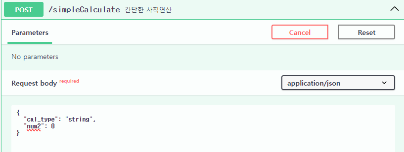
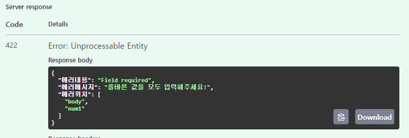
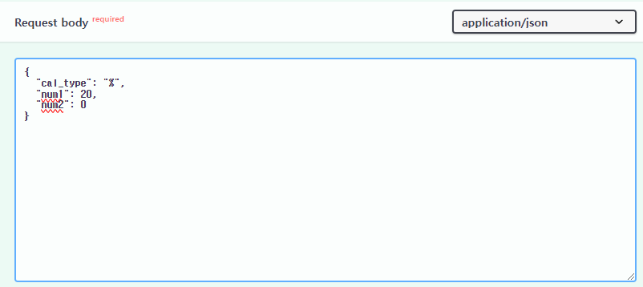
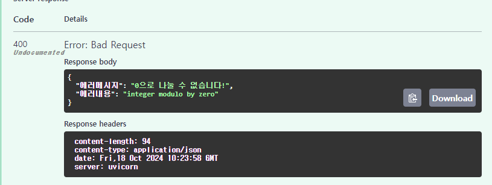

# 10/18 숙제

## 패키지 구성

- templates: 그림그리기 api를 호출할 때 결과를 확인해보고 싶어 Home 페이지 구성.
- service: api 호출 시 처리할 로직들을 담아 놓은 파일.
- schemas: request body 또는 response를 형식화하기 위해 작성
- exception_handlers.py: 에러가 발생 했을 때 에러 유형에 따라 다른 결과(에러메시지, 원인 등등)를 클라이언트에 보내주기 위해 작성.

## 추가기능 설명

1. slicingCalculate(범위 연산)
    : 연산 유형("+","\*")을 받고 두 정수(num1,num2)를 입력 받으면 입력 받은 두 정수 사이 만큼 더하거나 곱해준다.

2. drawPicture(주어진 문자로 그림 그리기)

   - 입력값: select(그리기 유형), word(그릴 문자), count(그리기 반복할 줄 수)
   - select는 swagger 상에서 정해놓은 유형만 고를 수 있게 Literal 타입 설정.
   - word는 한 글자만 입력할 수 있게 Query 사용하여 설정
   - 그리기 유형에 따라 별 그리는 예제 유형 처럼 각기 다른 모양으로 그리되, 그릴 문자와 반복할 줄 수도 설정할 수 있게 하였다.

3. exception_hander도 추가 기능일 것 같아 넣어봤습니다.

   - validation 에러 발생 시 에러내용 및 에러메시지와 함께 어느 필드에서 문제가 발생했는지 위치 정보까지 담아주었습니다.  
        
     num1 값을 넣지 않고 제출할 경우 다음과 같은 response를 보냄.   
        

   - ZeroDivisionError 발생 시  
        
     num2에 0을 넣고 나누도록 하면   
     
